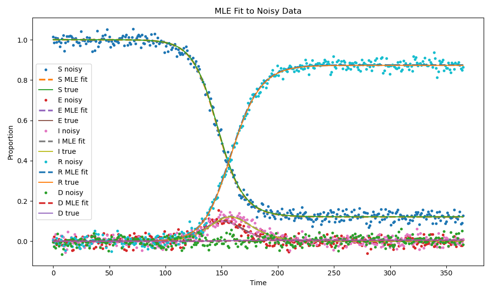
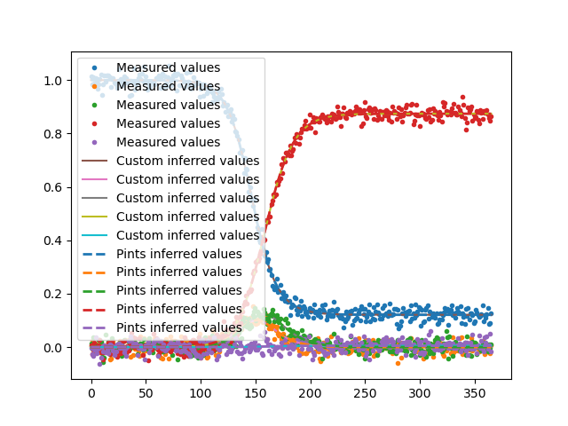
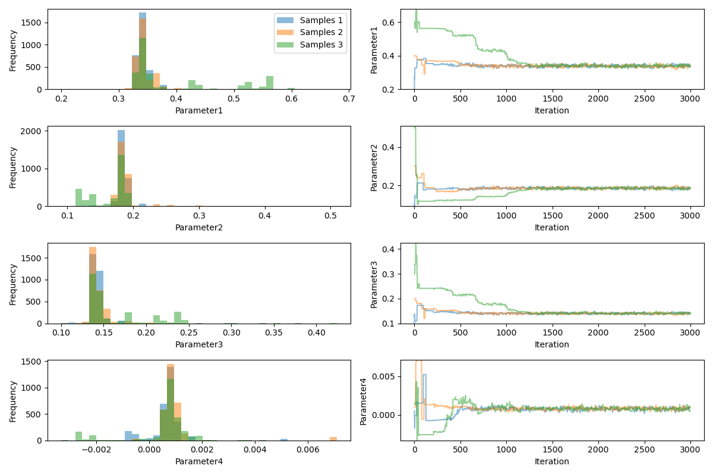
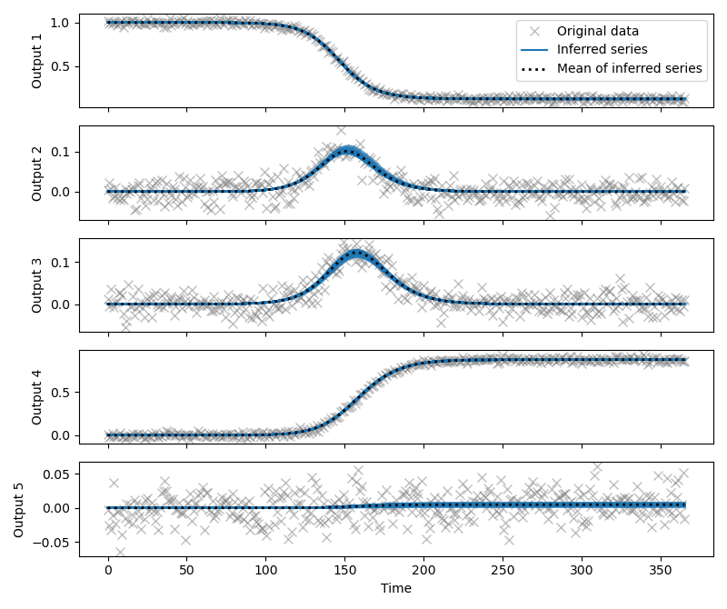

# Week Two: Inference
We look at the inverse problem in week two. Given noisy data, we first find the optimal or maximum likelihood values of the parameters, and then use an MCMC sampling method to estimate the posterior distribution of these parameters. Key resources are:
- [Bayesian inference, sampling and PINTS](https://github.com/pints-team/pints/blob/main/examples/stats/beginners-tutorial.ipynb)
- [Real data and SIR model](https://github.com/pints-team/pints/blob/main/examples/toy/model-sir.ipynb)
- [Another model in PINTS](https://github.com/pints-team/pints/blob/main/examples/toy/model-fitzhugh-nagumo.ipynb)
- [Other examples](https://github.com/pints-team/pints/tree/main/examples/toy)

## 2.1 Notes on Bayesian Inference and Sampling
Following the [PINTS tutorial](https://github.com/pints-team/pints/blob/main/examples/stats/beginners-tutorial.ipynb), we first try to understand the mathematical background of bayesian inference and sampling.
### 2.1.1 Bayesian Inference
Bayesian inference is essentially maximum likelihood estimation (MLE) with prior distributions. According to the Bayes' theorem, the posterior distribution is: 

$$P(\theta|y) = \frac{P(y|\theta) P(\theta)}{P(y)}$$ 

Given that the denominator $P(y)$ does not vary with parameters, maximizing $P(\theta|y)$ is equivalent to maximizing product $P(y|\theta) P(\theta)$. 

Mathematically, this is the same as minimizing the square error between the observed data and the model output. As a result, we can use mean squared error as the loss function to optimize parameters.

See [1inverse.py](1inverse.py) for `scipy.optimize.minimize` codes, and here's the result:


### 2.1.2 MCMC Sampling
You can find the detailed rules for Metropolis Hastings on the [tutorial](https://github.com/pints-team/pints/blob/main/examples/stats/beginners-tutorial.ipynb). Main steps are:
1. Start with a random parameter vector $\theta_0$. Calculate the product $P(y|\theta) P(\theta)$, using Gaussian distribution for likelihood and Uniform distribution for prior.
2. Randomly select a new parameter vector $\theta$ from a Gaussian distribution centered at $\theta_0$, and calculate the product $P(y|\theta) P(\theta)$.
3. Compare the two products, and decide on which parameter vector to keep and add to list.
4. Repeat steps 2 and 3 for N steps.
5. Count your list of $\theta$s into bins and draw a histogram, which is the posterior distribution of $\theta$.

The basic idea is that if we sample for enough times, the histogram consisting of all optimal parameters will approximate the true posterior distribution of $\theta$.

For convenience, I didn't hand-code the custom Metropolis Hastings, but used PINTS directly. See the next part for more details.

## 2.2 Using PINTS
Before we continue with PINTS, I want to first add that I made the noisy data by adding Gaussian noise to each of the five compartments simulated by the SEIRD model.

PINTS is a package that contains many models, and can do bayesian inference in a simpler and faster way. In the optimization problem, we first define the model class `PintsSEIRD` inheriting from `pints.ForwardModel`, whose `simulate` function provides the physical model `seird`. Then, we can use `pints.MultiOutputProblem` instance and `pints.SumOfSquaresError` to perform optimisation. The result is close to the MLE estimated parameters.
```
True params: [0.34285714285714275, 0.18181818181818182, 0.1419142857142857, 0.0009428571428571429]
MLE estimated params: [0.33810695 0.18503249 0.13988259 0.00078901]
Pints MLE params: [0.33978187 0.18391113 0.14058606 0.00079137]
```


In terms of MCMC sampling, PINTS provides some extremely convenient interfaces as well. Based on this, we can easily define and wrap a `problem`, set the startpoint of different chains, define a statistical problem using `pints.MCMCController`, set the number of iterations and finally run it to generate visual results. Here we can see the traces of each chain converge:


and the model fitted well:



Please see all the codes in [1inverse.py](1inverse.py).

## 2.3 Real Data and SIR Model
Compared to the synthetic data generated from real SEIRD model and consistent Gaussian noise, the data we gather in real life is usually limited in time and kind. For example, in epidemic control, we need to predict the disease trajectory based on early-on data. Also, while I and R compartments are relatively easy to obtain, it is impractical to keep track of S and E. Therefore, we may need to simplify the model due to the scarcity of data.

I think model simplification should take into account the attibutes of the disease itself. In this case, the epidemic was a **common-cold** outbreak, so maybe the incubation period was relatively short and the mortality rate was low. Therefore, it makes sense to omit E as it is instantly converted to I, and D as it is close to zero.

Codes can be found on [Real data and SIR model](https://github.com/pints-team/pints/blob/main/examples/toy/model-sir.ipynb). This is almost identical to [1inverse.py](1inverse.py), so I didn't code it up again.
