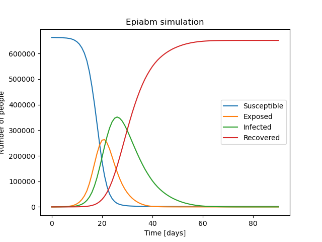
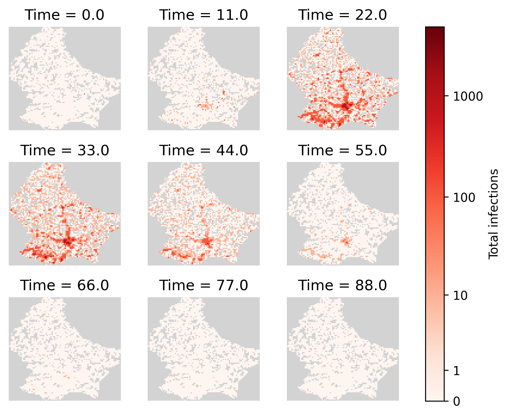
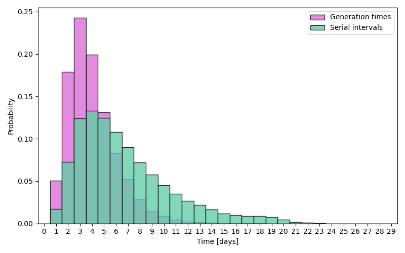
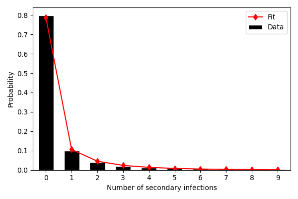
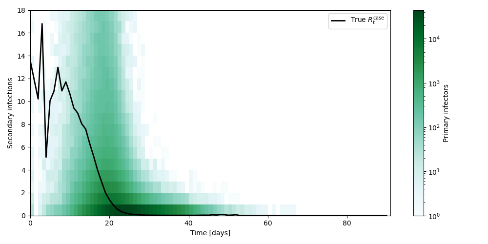
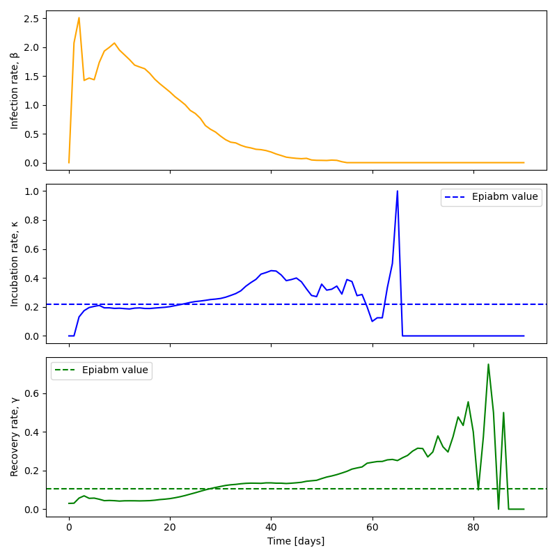

# Week 3/4/5: Spatial Heterogeneity
So far, to make the problem simpler, our SEIRD model is based on the assumption that the population is geographically homogeneous, i.e. population density and transmission rate are the same across the entire region. However, this is not necessarily true in reality. In this week, we introduce spatial heterogeneity to the model, and use the synthetic data generated by agent-based models (ABMs) to assess SEIRD models. 

Papers:
- [EpiGeoPop](https://arxiv.org/abs/2310.13468)
- [Assessing the performance of compartmental for learning Rt using spatially heterogeneous epidemic simulations on real geographies](https://arxiv.org/pdf/2503.04648)

Github repository: [EpiGeoPop](https://github.com/SABS-R3-Epidemiology/EpiGeoPop) and [Epiabm](https://github.com/SABS-R3-Epidemiology/epiabm)

Here's the gist:
- With the aid of EpiGeoPop, use ABMs (Epiabm) to generate data for complex outbreaks.
- Calculate the ground-truth $R_t^{case}$ for these ABM data.
- Fit the SEIR model to the prevalence data from Epiabm (Infected compartment).
- Use the ABM data and ground-truth $R_t^{case}$ to evaluate compartmental models for inferring $R_t$: use $R_t^{inst}$ to infer $R_t^{case}$; analyse parameters $\beta$, $\kappa$ and $\gamma$ as well.
- Conclusion: SEIR models can infer $R_t^{case}$ from ABM data with little spatial variation, but struggle with increased spatial variation.

## 3.1 EpiGeoPop: Population Configuration
EpiGeoPop is a user-friendly tool for generating **population configurations** (visualizing as well) and **parameters related to age distribution** based on global population data, facilitating and standardizing the complex and time-comsuming model set up in **Agent-based models** (ABMs). ABMs are an alternative to traditional mathematical models, as they can capture spatial heterogeneity, particularly when assessing intervention strategies. Combined with Epiabm, they can demonstrate how spacial patterns influence the spread of disease and the response to intervention.

- Input: Public data on borders, population density, and age distribution.
- Output: Standardized population configuration [`NI_microcells.csv`](./Epiabm_simulation/NI_inputs/NI_microcells.csv) and age-related parameters. We will only need the population configuration file in Epiabm, because age-related parameters are provided in [`.json` file](./Epiabm_simulation/NI_parameters.json).
- We can also visualize the population density [here](./Epiabm_simulation/NI_inputs/Luxembourg.pdf).

All instructions can be found on [EpiGeoPop Github page](https://github.com/SABS-R3-Epidemiology/EpiGeoPop), so I won't list code here for simplicity. One thing worth noting is that for cities, provinces and countries, we always have to follow the admin type in public dataset and correctly refer to a region in `configs` and `Snakefile`, so we need to check the public dataset first.

**Question**: As I couldn't find Northern Ireland (used in the [assessment paper](https://arxiv.org/pdf/2503.04648)) in the province or country setting, I will use Luxembourg (which is about half the population) in the following work.

## 3.2 Epiabm
Given population configuration input, we can use Epiabm to simulate the disease spread. Obeying the workflow in [Epiabm NI_example](https://github.com/SABS-R3-Epidemiology/epiabm/tree/main/python_examples/NI_example), we can get the following simulation results (infection radius 90km).

### 3.2.1 The SEIR compartmental aggregates

### 3.2.2 Spacial behaviour of the infection wave
Generated by EpiGeoPop `make_gif.py`.

Compared with the population density map, we can see that the infection in dense areas come earlier, peak higher and last longer.

### 3.2.3 Generation time and serial interval distribution
Use `generation_times.csv` and `serial_intervals.csv`, collect all numbers, drop `nan`, and generate the distribution plot.

### 3.2.4 Secondary infections
Similar methodology as above, use `secondary_infections.csv`, and also fit to negative binomial distribution to check model realism.

### 3.2.5 True $R_t^{case}$
According to the paper, daily $R_t^{case}$ is the average number of secondary infections by individuals who are newly exposed on that day. We linearly interpolate $R_t^{case}$ for days with no newly exposed individuals.

### 3.2.6 Time-varying parameters
Use synthetic data as input, calculate the compartmental derivatives to get time-varying parameters.

## 3.4 SEIR Inference
TO DO
- The workflows for conducting all model inference are contained [here](https://github.com/SABS-R3-Epidemiology/seirmo/tree/main/examples/epiabm_rt_inference/northern_ireland).
