# Week 3/4/5: Spatial Heterogeneity
So far, to make the problem simpler, our SEIRD model is based on the assumption that the population is geographically homogeneous, i.e. population density and transmission rate are the same across the entire region. However, this is not necessarily true in reality. In this week, we introduce spatial heterogeneity to the model, and use the synthetic data generated by agent-based models (ABMs) to assess SEIRD models. 

Papers:
- [EpiGeoPop](https://arxiv.org/abs/2310.13468)
- [Assessing the performance of compartmental for learning Rt using spatially heterogeneous epidemic simulations on real geographies](https://arxiv.org/pdf/2503.04648)

The workflow consists of three steps:
1. [EpiGeoPop](https://github.com/SABS-R3-Epidemiology/EpiGeoPop): generate standardised population configuration file for a certain region
2. [Epiabm](https://github.com/SABS-R3-Epidemiology/epiabm): generate epidemic simulation data based on the population configuration file
3. [SEIRMO](https://github.com/SABS-R3-Epidemiology/seirmo/blob/main/examples/epiabm_rt_inference/northern_ireland/northern_ireland_rt_inference.ipynb): model inference, generate Rt estimates by SEIR models and other relevant plots

## 3.1 EpiGeoPop: Population Configuration
EpiGeoPop is a user-friendly tool for generating **population configurations** (visualizing as well) and **parameters related to age distribution** based on global population data, facilitating and standardizing the complex and time-comsuming model set up in **Agent-based models** (ABMs). ABMs are an alternative to traditional mathematical models, as they can capture spatial heterogeneity, particularly when assessing intervention strategies. Combined with Epiabm, they can demonstrate how spacial patterns influence the spread of disease and the response to intervention.

- Input: Public data on borders, population density, and age distribution.
- Output: Standardized population configuration [`NI_microcells.csv`](./Epiabm_simulation/NI_inputs/NI_microcells.csv) and age-related parameters. We will only need the population configuration file in Epiabm, because age-related parameters are provided in [`.json` file](./Epiabm_simulation/NI_parameters.json).
- We can also visualize the population density [here](./Epiabm_simulation/NI_inputs/Luxembourg.pdf).

All instructions can be found on [EpiGeoPop Github page](https://github.com/SABS-R3-Epidemiology/EpiGeoPop), so I won't list code here for simplicity. One thing worth noting is that for cities, provinces and countries, we always have to follow the admin type in public dataset and correctly refer to a region in `configs` and `Snakefile`, so we need to check the public dataset first.

**Note**: As I couldn't find Northern Ireland (used in the [assessment paper](https://arxiv.org/pdf/2503.04648)) in the province or country setting, I used Luxembourg (which is about half the population) in the following work.

## 3.2 Epiabm: Simulation
Given population configuration input, we can use Epiabm to simulate the disease spread. Obeying the workflow in [Epiabm NI_example](https://github.com/SABS-R3-Epidemiology/epiabm/tree/main/python_examples/NI_example), we can get the following simulation results.

To construct homogeneous population density, I used [get_homo.py](./Epiabm_simulation/NI_inputs/get_homo.py) to average `household_number`, `place_number` and `Susceptible` across the population, first allocating the base and then randomly adding the remainder to obtain discrete values.

PS. I did simulation and inference in three settings: homogenous, infection radius 90km (low heterogeneity) and infection radius 18km (high heterogeneity). If they all follow the same pattern, I'll only use r = 90km as an example. For comparison, I'll demonstrate model outputs in the order of increasing heterogeneity.

### 3.2.1 The SEIR compartmental aggregates
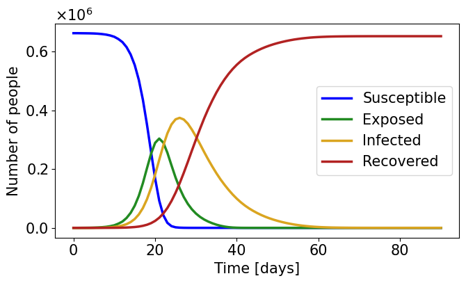
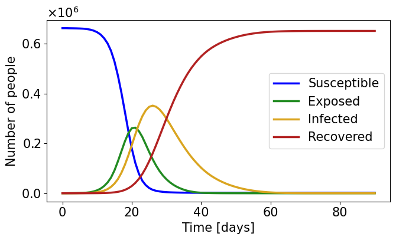
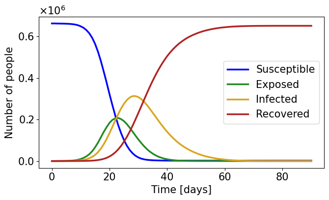
As the heterogeneity increases, E and I curves become smoother, with slower and lower peaks.

### 3.2.2 Spacial behaviour of the infection wave
Generated by EpiGeoPop `make_gif.py`.
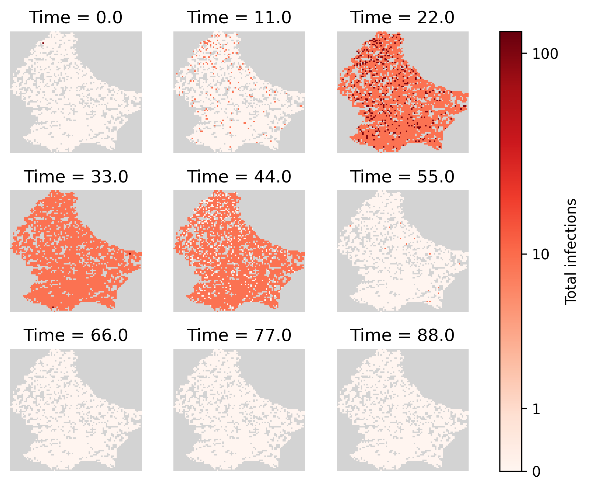
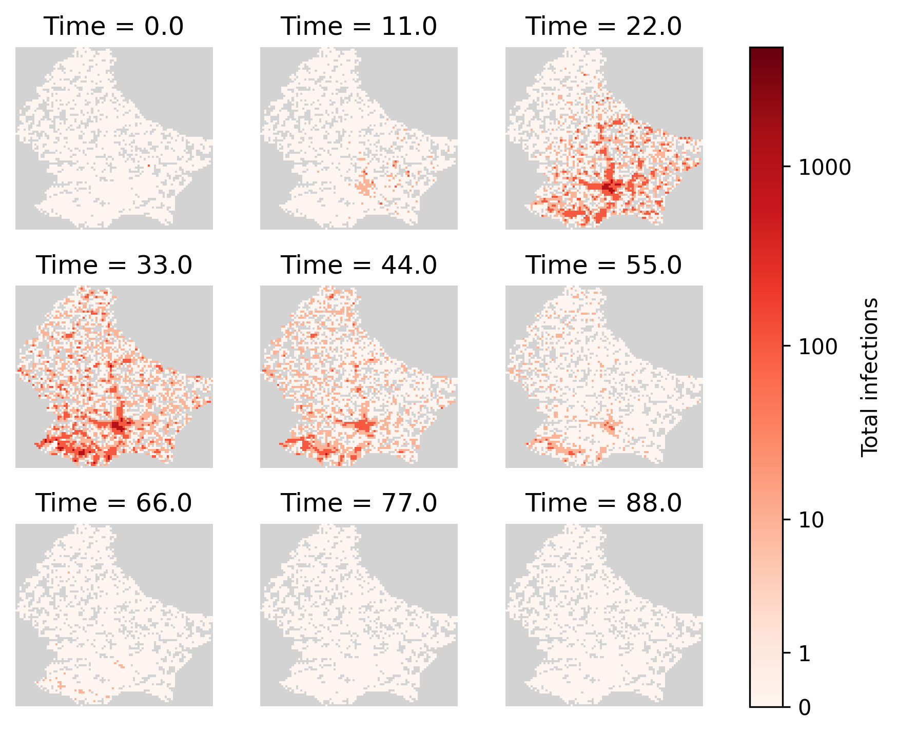


Compared with the population density map, we can see that the infection in dense areas come earlier, peak higher and last longer.

## 3.3 SEIRMO: Inference
Detailed tutorial on SEIRMO inference can be found [here](https://github.com/SABS-R3-Epidemiology/seirmo/blob/main/examples/epiabm_rt_inference/northern_ireland/northern_ireland_rt_inference.ipynb), and our code [here](./luxembourg_rt_inference.py) follows the same structure. I recommend using the second way of installation, as the first approach couldn't work on my computer.

### 3.3.1 Generation time and serial interval distribution
Use `generation_times.csv` and `serial_intervals.csv`, collect all numbers, drop `nan`, and generate the distribution plot.
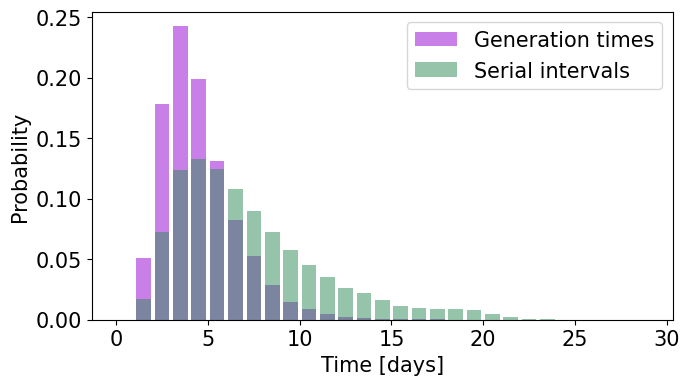

### 3.3.2 Secondary infections
Similar methodology as above, use `secondary_infections.csv`.
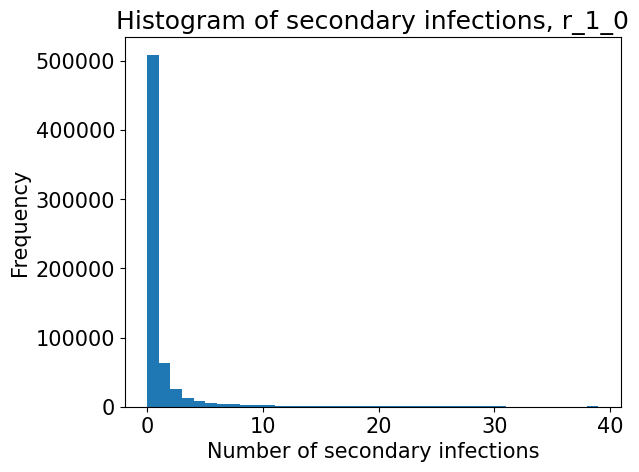

### 3.3.3 True $R_t^{case}$
According to the paper, daily $R_t^{case}$ is the average number of secondary infections by individuals who are newly exposed on that day. We linearly interpolate $R_t^{case}$ for days with no newly exposed individuals.
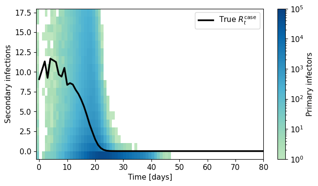
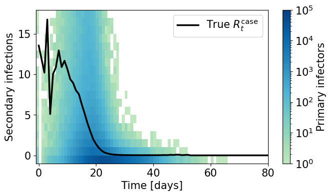
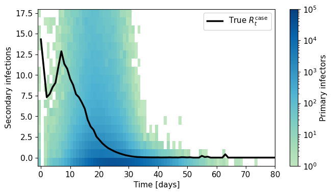
We can see the mean of Rt is relatively consistent, but they have different fluctuations. The small peak around day 63 in r = 18km is probably formed when infection enters another high density region of south-west Luxembourg.

### 3.3.4 Time-varying parameters
Use synthetic data as input, calculate the compartmental derivatives to get time-varying parameters.
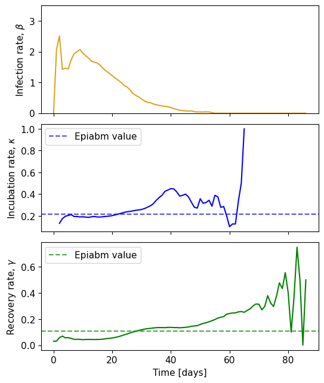

‼️We can directly calculate $\beta$ and $\gamma$ from `Eq 1` and `Eq 4`, but we get different results of $\kappa$ when we use `Eq 2` and $\beta$ vs. `Eq 3` and $\gamma$, where the first method gives us positive results and the latter gives us negative ones. Why is that?

### 3.3.5 PINTS MCMC sampling
Similar to week 2, we use PINTS to sample the posterior distribution of the parameters. We use an order one auto-regrassive log-likelihood, which introduces two more parameters $\rho$ and $\sigma$. We perform a two step optimisation: first run ten optimisations maximising this log-likelihood, then refine these estimates by running 4 chains of 16000 iterations to find the posterior distribution, staring each chain close to the optimal parameter set obtained from the first step. We use 50% warm-up. The results are shown below.

For homogeneous population:
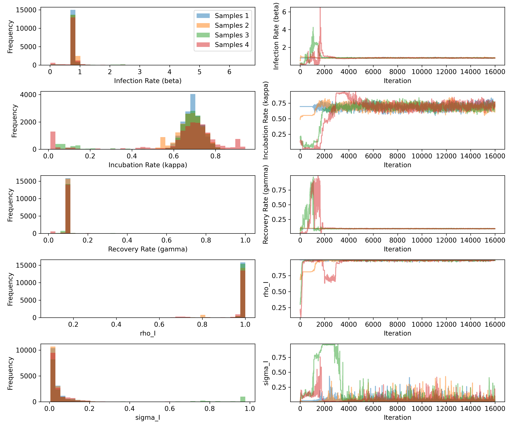
```
R_hat value for Infection Rate (beta): 1.00617
R_hat value for Incubation Rate (kappa): 1.00577
R_hat value for Recovery Rate (gamma): 1.00839
R_hat value for rho_I: 1.00207
R_hat value for sigma_I: 1.00405
```

For r = 90km:
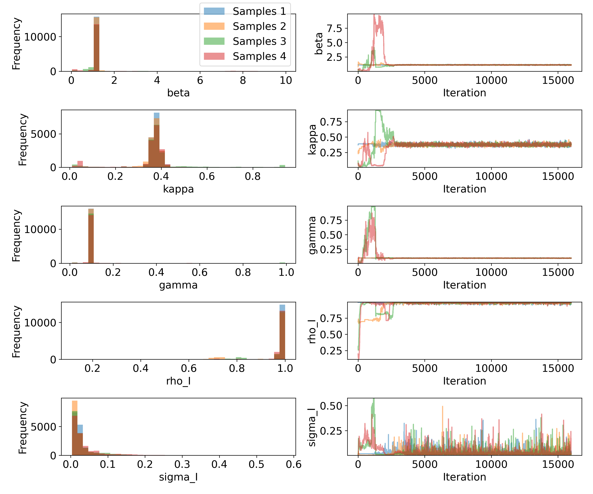
```
R_hat value for beta: 1.00124
R_hat value for kappa: 1.00131
R_hat value for gamma: 1.00335
R_hat value for rho_I: 1.00219
R_hat value for sigma_I: 1.00433
```
We can see that the chains converge well. However, it seems the performance of r = 90km is better than that of homogeneous population.

### 3.3.6 SEIR compartmental result
Given the chains, we can sample 1000 parameter sets from the posterior distribution and simulate the SEIR compartmental model for each set.
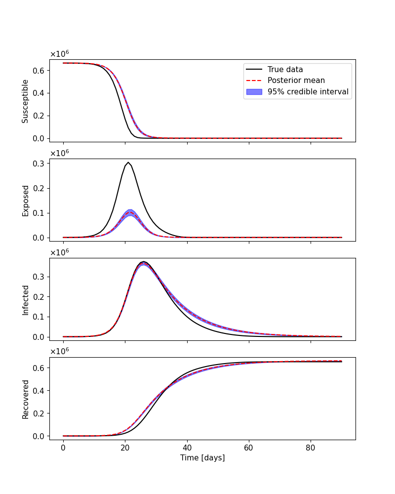
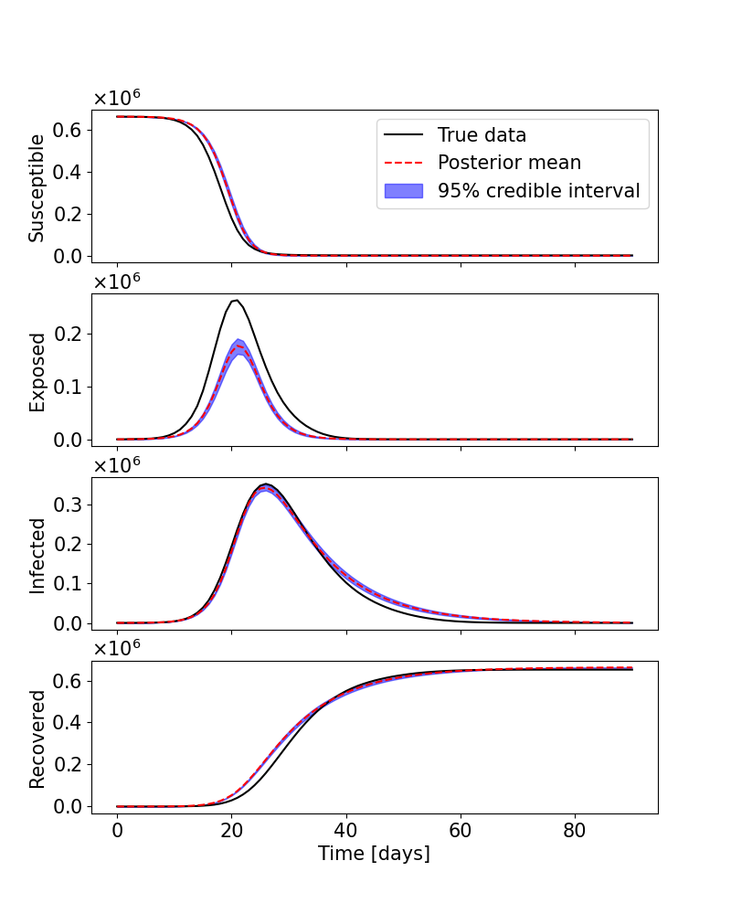
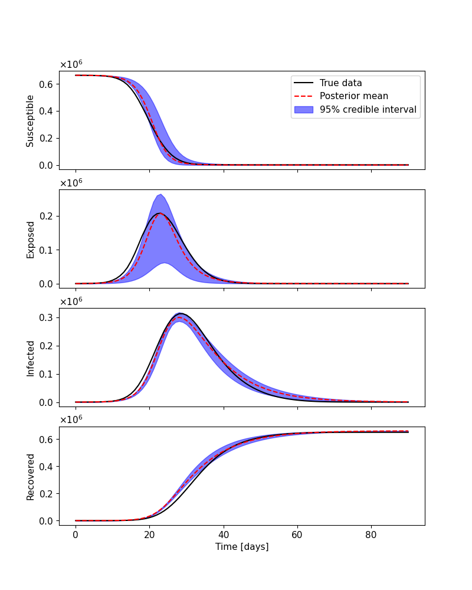
Weirdly, higher heterogeneity leads to better performance. And r = 18km didn't converge to unimodal result.

### 3.3.7 Rt_case
Lastly, let's generate SEIR estimated Rt_case.
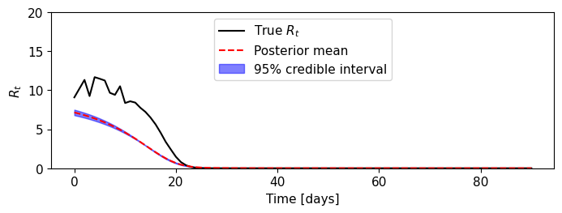
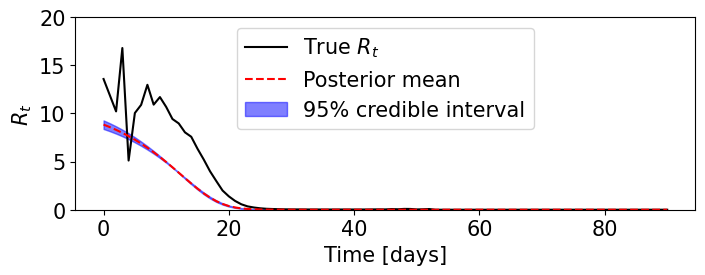
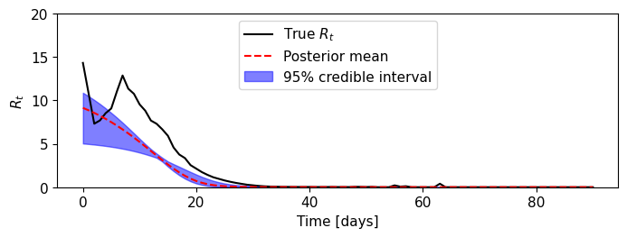