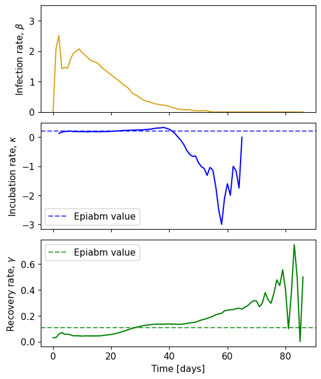
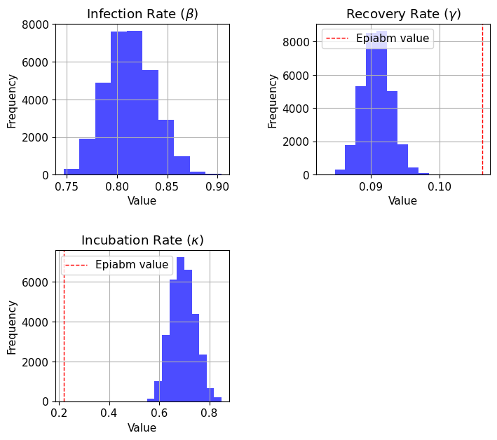
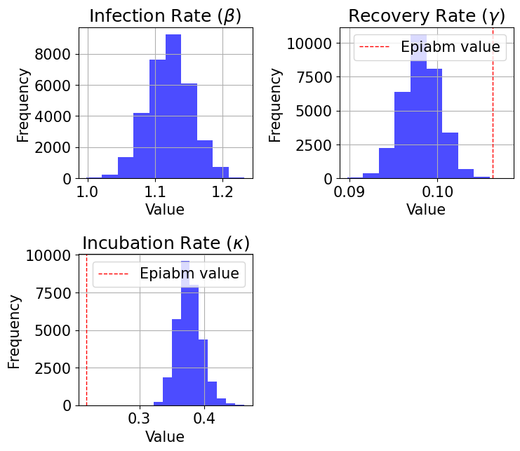
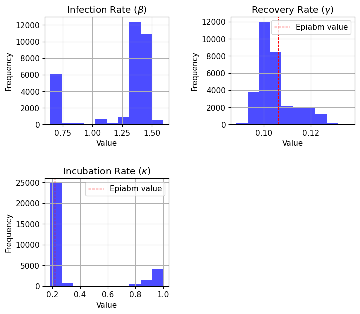
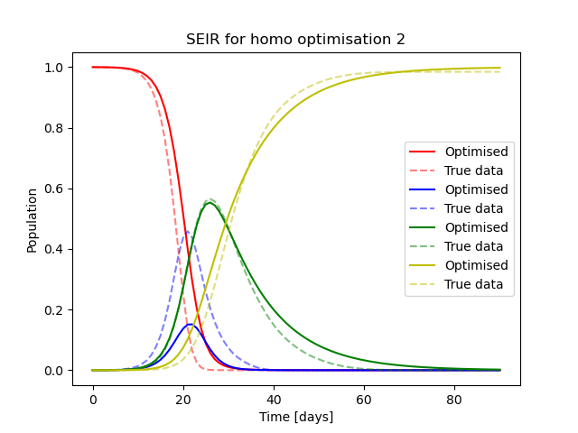
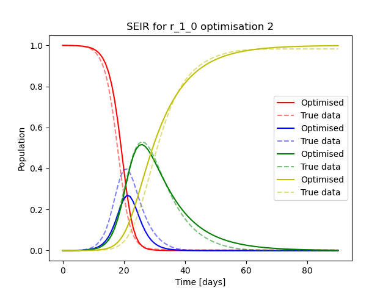
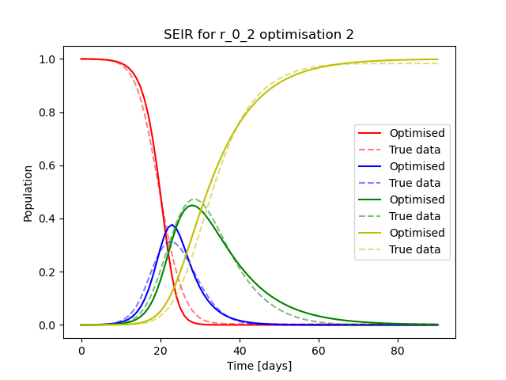

# Week 3~5: SEIR and Heterogeneity
So far, to make the problem simpler, our SEIRD model is based on the assumption that the population is geographically homogeneous, i.e. population density and transmission rate are the same across the entire region. However, this is not necessarily true in reality. In this week, we introduce spatial heterogeneity to the model, and use the synthetic data generated by agent-based models (ABMs) to assess SEIRD models' performance. 

Papers:
- [EpiGeoPop](https://arxiv.org/pdf/2310.13468)
- [Assessing the performance of compartmental and renewal models for learning Rt using spatially heterogeneous epidemic simulations on real geographies](https://arxiv.org/pdf/2503.04648)

The workflow consists of three steps:
1. [EpiGeoPop](https://github.com/SABS-R3-Epidemiology/EpiGeoPop): generate standardised population configuration file for a certain region
2. [Epiabm](https://github.com/SABS-R3-Epidemiology/epiabm): generate epidemic simulation data based on the population configuration file
3. [SEIRMO](https://github.com/SABS-R3-Epidemiology/seirmo/blob/main/examples/epiabm_rt_inference/northern_ireland/northern_ireland_rt_inference.ipynb): model inference, generate SEIR estimated Rt and other relevant plots

## 3.1 EpiGeoPop: Population Configuration
EpiGeoPop is a user-friendly tool for generating **population configurations** (visualizing as well) and **parameters related to age distribution** based on global population data, facilitating and standardizing the complex and time-comsuming model set up in **Agent-based models** (ABMs). ABMs are an alternative to traditional mathematical models, as they can capture spatial heterogeneity, particularly when assessing intervention strategies. Combined with Epiabm, they can demonstrate how spacial patterns influence the spread of disease and the response to intervention.

- Input: Public data on borders, population density, and age distribution.
- Output: Standardized population configuration [`NI_microcells.csv`](./Epiabm_simulation/NI_inputs/NI_microcells.csv) and age-related parameters. We will only need the population configuration file in the next step, because age-related parameters are already provided by [`.json` file](./Epiabm_simulation/NI_parameters.json).
- Visualized population density is [here](./Epiabm_simulation/NI_inputs/Luxembourg.pdf).

All instructions can be found on [EpiGeoPop Github page](https://github.com/SABS-R3-Epidemiology/EpiGeoPop), so I won't list code here for simplicity. One thing worth noting is that for cities, provinces and countries, we always have to follow the admin type in public dataset and correctly refer to a region in `configs` and `Snakefile`, so we need to check the public dataset first.

**Note**: As I couldn't find Northern Ireland (used in the [paper](https://arxiv.org/pdf/2503.04648)) in the province or country setting, I used Luxembourg (which is about half the population) in the following work.

## 3.2 Epiabm: Simulation
Given population configuration input, we can use Epiabm to simulate the disease spread. Obeying the workflow in [Epiabm NI_example](https://github.com/SABS-R3-Epidemiology/epiabm/tree/main/python_examples/NI_example), we can get the following simulation results.

See simulation input (EpiGeoPop output) and code in [Epiabm_simulation](Epiabm_simulation). I used an evenly distributed population of Luxembourg as the benchmark for heterogeneous results. To construct this homogeneous population, I used [get_homo.py](./Epiabm_simulation/NI_inputs/get_homo.py) to average `household_number`, `place_number` and `Susceptible` across the population, first allocating the base and then randomly adding the remainder to obtain discrete values.

PS. I did simulation and inference in three settings: homogenous, infection radius 90km (low heterogeneity) and infection radius 18km (high heterogeneity). If they all follow the same pattern, I'll only use r = 90km as an example. For comparison, I'll demonstrate model outputs in the order of increasing heterogeneity.

### 3.2.1 The SEIR compartmental aggregates


As the heterogeneity increases, E and I curves become smoother, with slower and lower peaks.

### 3.2.2 Spacial behaviour of the infection wave
Generated by EpiGeoPop `make_gif.py` using `output_NI.csv`. Also see grid screenshots in [animation](./animation) folder.


Compared with the population density map, we can see that the infection in dense areas come earlier, peak higher and last longer.

## 3.3 SEIRMO: Inference
Detailed tutorial on SEIRMO inference can be found [here](https://github.com/SABS-R3-Epidemiology/seirmo/blob/main/examples/epiabm_rt_inference/northern_ireland/northern_ireland_rt_inference.ipynb), and our code [luxembourg_rt_inference.py](./luxembourg_rt_inference.py) follows the same structure. I recommend using the second way of installation on the [tutorial](https://github.com/SABS-R3-Epidemiology/seirmo/blob/main/examples/epiabm_rt_inference/northern_ireland/northern_ireland_rt_inference.ipynb), as the first approach couldn't work on my computer.

### 3.3.1 Generation time and serial interval distribution
Simulation results can be found in [NI_outputs](./NI_outputs). Use `generation_times.csv` and `serial_intervals.csv`, collect all numbers, drop `nan`, and generate the distribution plot.


### 3.3.2 Secondary infections
Similar methodology as above, use `secondary_infections.csv`.


### 3.3.3 True $R_t^{case}$
According to the paper, daily $R_t^{case}$ is the average number of secondary infections by individuals who are newly exposed on that day. We linearly interpolate $R_t^{case}$ for days with no newly exposed individuals.


We can see the mean of Rt is relatively consistent, but they have different fluctuations. The small peak around day 63 in r = 18km is probably formed when infection enters another high density region in south-west Luxembourg.

### 3.3.4 Time-varying parameters
Use synthetic data as input, calculate the compartmental derivatives to get time-varying parameters.



‼️We do this by directly calculating $\beta$ and $\gamma$ from `Eq 1` and `Eq 4`, and then get $\kappa$ based on them. However, we get different results of $\kappa$ when we use `Eq 2` and $\beta$ (positive in the first plot) vs. `Eq 3` and $\gamma$ (negative in the second plot). Why is that?

### 3.3.5 PINTS MCMC sampling
Similar to week 2, we use PINTS to sample the posterior distribution of the parameters. We use an order one auto-regrassive log-likelihood, which introduces two more parameters $\rho$ and $\sigma$. We perform a two step optimisation:
1. Run ten optimisations maximising this log-likelihood.
2. Refine these estimates by running 4 chains of 16000 iterations to find the posterior distribution, staring each chain close to the optimal parameter set obtained from the first step. 

The results in [chain_data](./chain_data) are shown below. We used 50% warm_up when calculating $\hat{R}$.

For homogeneous population:

```
R_hat value for Infection Rate (beta): 1.00617
R_hat value for Incubation Rate (kappa): 1.00577
R_hat value for Recovery Rate (gamma): 1.00839
R_hat value for rho_I: 1.00207
R_hat value for sigma_I: 1.00405
```

For r = 90km:

```
R_hat value for beta: 1.00124
R_hat value for kappa: 1.00131
R_hat value for gamma: 1.00335
R_hat value for rho_I: 1.00219
R_hat value for sigma_I: 1.00433
```
We can see that 50% warm up is enough and the chains converge well. However, it seems the convergence of r = 90km is better than that of homogeneous population.

### 3.3.6 SEIR compartmental result
Given the chains, we can sample 1000 parameter sets from the posterior distribution and obtain SEIR inference results. See [inference_outputs](./inference_outputs) for full result. Parameter distribution:




Here we can see a clear pattern: the higher the heterogeneity, the closer the distribution is to the true parameters $\kappa$ and $\gamma$, which is the entire opposite of what we would expect. And here are compartmental results:


Although r = 18km doesn't have unimodal convergence, we can still see that higher heterogeneity leads to better performance.

### 3.3.7 $R_t^{case}$
Lastly, let's generate SEIR estimated $R_t^{case}$ from $R_t^{inst}$.


In conclusion, higher heterogeneity leads to better performance. This is the entire opposite of what we would expect!

## 3.4 Code checking
As the result is not what we desired, I constructed a smaller [check_opt code](check_opt.py) to check if our optimisation result is correct. In this code, I only changed one line from the [SEIRMO tutorial](https://github.com/SABS-R3-Epidemiology/seirmo/blob/main/examples/epiabm_rt_inference/northern_ireland/northern_ireland_rt_inference.ipynb): I added `pints_model._n_outputs = 4` before simulating the results, so we can visualize all four estimated compartments. The results can be found in [optimisation_outputs](./optimisation_outputs):




It's clear that the main problem lies with the **exposed** compartment. Looking back to the posteriors, we see that higher heterogeneity leads to higher $\beta$, lower $\kappa$ and higher $\gamma$, which, according to the differential equations:

$$\frac{dS(t)}{dt} = -\frac{\beta}{N} S(t)I(t)$$
$$\frac{dE(t)}{dt} = \frac{\beta}{N} S(t)I(t) - \kappa E(t)$$
$$\frac{dI(t)}{dt} = \kappa E(t) - \gamma I(t)$$
$$\frac{dR(t)}{dt} = \gamma I(t)$$

leads to higher E and lower I. These optimization results are entirely consistent with mcmc results, so to explain why the outcome is the entire opposite of our intuition, here are some potential reasons:
1. MCMC code is wrong: this is unlikely as mcmc result aligns with optimization result, and optimization result is already wrong.
2. Optimization code is wrong: this could happen but I've carefully checked the [check_opt code](check_opt.py), and it's almost identical to the [SEIRMO tutorial](https://github.com/SABS-R3-Epidemiology/seirmo/blob/main/examples/epiabm_rt_inference/northern_ireland/northern_ireland_rt_inference.ipynb), except for `pints_model._n_outputs = 4` I added before simulating optimized result.
3. `seir.csv` is wrong: different from the [SEIRMO tutorial](https://github.com/SABS-R3-Epidemiology/seirmo/blob/main/examples/epiabm_rt_inference/northern_ireland/northern_ireland_rt_inference.ipynb), my Epiabm doesn't directly give me an `seir.csv` file, so I have to manually sum up the four compartments in [NI_flow.py](./Epiabm_simulation/NI_flow.py) and save it as `seir.csv`. I strictly followed the pattern in the [Epiabm NI_example](https://github.com/SABS-R3-Epidemiology/epiabm/blob/main/python_examples/NI_example/NI_flow.py), where it sums up S, I, R compartments to generate the plot, so I think it's most likely correct.
4. The code is right and our intuition for the model doesn't work in Luxembourg: although it's straightforward logic that SEIR models should work better in homogeneous populations than heterogeneous ones, as homogeneity is a key assumption, it's possible to get opposite results due to other factors. Maybe we can look deeper into estimated parameter values and other plots to determine the cause.

The following steps would be to:
1. Check `seir.csv` summing code at the end of [NI_flow.py](./Epiabm_simulation/NI_flow.py).
2. Check optimization code in [check_opt.py](./check_opt.py).
3. If they are both correct, try to examine why the opposite happened with Luxembourg.
