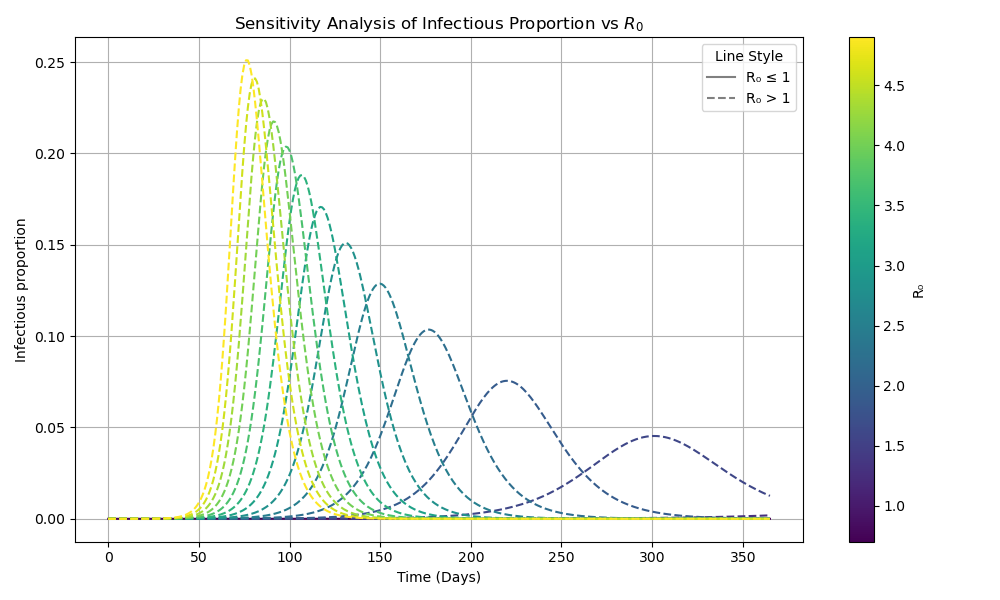

# Epidemic dynamics in SEIRD
This is the weekly note for my project in Trinity Term 2025 at the University of Oxford. The topic is modelling epidemic dynamics using SEIRD model in aid of policy making and disease control.

## Week One: SEIRD Models
The task in week one is to learn, code up and fully understand the SEIRD model. Main resources are:
- [Learning transmission dynamics modelling of COVID-19 using comomodels](https://doi.org/10.1016/j.mbs.2022.108824)
- [comomodels repository on Github](https://como-dtc-collaboration.github.io/como-models/articles/SEIRD.html)
- Anderson, Roy M, and Robert M May. 1992. Infectious Diseases of Humans: Dynamics and Control. Oxford university press.

Codes and results are in [1_SEIRD](1_SEIRD) folder.

### 1.1 Notes on SEIRD model
SEIRD model is a deterministic compartmental model that is used to estimate the transmission dynamics of infectious diseases. The model is a system of differential equations that describe the dynamics of the population in different compartments. Based on this, many more advanced models have been created to take into account complex factors in practice, such as age and spacial variations, interventions and uncertainty. Here I mainly note down the basic SEIRD model.

Our methodology mainly consists of three steps:
1. Determine model parameters. There are two ways to do this: i) use data collected in the laboratory or field to estimate individual parameters; or ii) to fit these models to field data and, in doing so, estimate potentially a collective of parameters.
2. Solve the model. Use python and ode solvers to get the "state" and "change" plots of each compartment.
3. Use the result, especially R-value, in policy making.

### 1.2 Coding
Here, we follow the first approach to parameterising the SEIRD model: directly use results from other researches. The SEIRD model has four transmission parameters: $\beta$, $\kappa$, $\gamma$ and $\mu$.
- $\kappa = 1 / \text{average latent period}$, as it means the rate at which exposed individuals become infectious.
- $\gamma$ = $\zeta$ * (1 - IFR), $\mu$ = $\zeta$ * IFR. Because $\mu / (\gamma + \mu)$ means the proportion of infecteds who go on to die, which is the IFR; and $\gamma + \mu = \zeta$, which is the rate at which infectious individuals recover or die, so $\zeta = 1 / \text{average infectious duration}$.
- $\beta = R_0 * (\gamma + \mu)$. Because $R_0$ is the number of new infections that a single individual produces on average, which should be the multiplication of $\beta$, the number of new infections produced for a single infectious individual per unit time; and $1/(\gamma + \mu)$, which is the time an individual stays infectious.

In conclusion, we can estimate $\beta$, $\kappa$, $\gamma$ and $\mu$ from $\text{average latent period, IFR, average infectious duration}$ and $R_0$.

The model odes are as follows:
$$\frac{\text{d}S}{\text{d}t} = -\beta S I,$$
$$\frac{\text{d}E}{\text{d}t} = \beta S I -\kappa E,$$
$$\frac{\text{d}I}{\text{d}t} =\kappa E - (\gamma + \mu) I,$$
$$\frac{\text{d}R}{\text{d}t} = \gamma I,$$
$$\frac{\text{d}D}{\text{d}t} = \mu I,$$
$$\frac{\text{d}C}{\text{d}t} = \text{newly exposed} = \beta S I.$$
They model the flow of population in and out each of the five compartments, and are quite intuitive.

The initial conditions. At the beginning of the epidemic we introduce a small number of infectious individuals, assuming everyone is susceptible: $S(0) = 1 - 1e-6$, $I(0) = 1e-6$, $E(0) = R(0) = D(0) = C(0) = 0$. Throughout the process, the sum of them is always 1.

Finally, we can solve the model over one-year time span with steps of one day. We can then plot the cumulative results and calculate the daily incidence and daily deaths.

See `SEIRD.py` and [comomodels repository in Github](https://como-dtc-collaboration.github.io/como-models/articles/SEIRD.html) for details.

### 1.3 Sensitivity analysis
In practice, the estimation of parameters often leads to a subset of potential answers and has uncertainty. As a result, sensitivity analysis is crucial. Here we performed three types of sensitivity analysis to understand the impact of each parameter on the model.

`2sensitivity_beta.py`: Investigate the sensitivity of the infectious compartment to the transmission rate, $\beta$, and accordingly, the R-value. We can see from the resulting plot that only diseases with initial $R_0$ higher than 1 can successfully invade the population. This is because $R_0$ is the expected number of people infected by a single infectious individual when everyone is susceptible. If $R_0$ is less than 1, the number of infected individuals will decrease and the pathogen die out. In addition, the higher the $R_0$ and $\beta$, the faster the disease spreads, and the more people are infected.

`3sensitivity_I.py`: Investigate the sensitivity of the infectious compartment to all four parameters. Similar to the previous analysis, but only choose five different values for each parameter. 
- We can see from the trend that higher $\beta$ and $\kappa$ values lead to a faster and higher peak in the number of infected individuals, because they lead to inflows of compartment $I$. 
- On the contrary, higher $\gamma$ results in slower and less peak in $I$, because it represents the rate at which infectious individuals recover and become immune. 
- Since the mortality rate is extremely small, multiplying it by the same factor doesn't have as significant impact as the other three parameters.

`4sensitivity_SEIRD.py`: Investigate the sensitivity of the entire SEIRD model to all four parameters. For each of the four plots, we multiplied each parameter by 1.5, except for $\mu$, which was multiplied by 7.5 for more visible result. 
- Compared to the benchmark output, we can see that higher $\beta$ resulted in quicker and higher $E$ and $I$, and ealier steady state with higher $R$ and lower $S$ in the end. 
- Higher $\kappa$ resulted in quicker $E$ and $I$. Although $I$ peak is slightly higher, $E$ peak is slightly smaller, as it is quickly converted to $I$. The steady state came a bit earlier with no obvious change in the final value of $R$ and $S$. 
- Higher $\gamma$ had a significant effect as well. Both $E$ and $I$ were greatly postponed and diminished. Steady state came later with lower $R$ and higher $S$ in the end.
- Higher $\mu$ only increased the final $D$ in place of the final $R$. Because it is very small and mainly affects the distribution between $R$ and $D$ from $I$, but not the flowing rate among $S$, $E$ and $I$.

